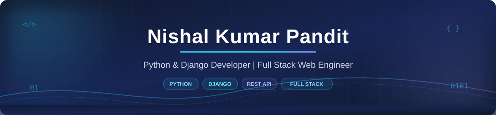
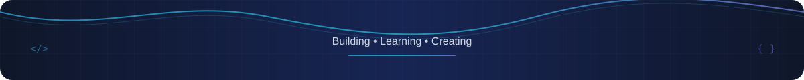

 

---

### 👋 About Me

Hey there! I am **Nishal**, a passionate Python and Django developer based in Ranchi, India.

I love building practical web applications that solve everyday business problems. Most of my time is spent creating solid backend architectures with Django and REST APIs, modeling clean databases, and connecting them to fast, responsive user interfaces.

- 📍 **Location:** Ranchi, India
- 💻 **Primary Focus:** Python, Django, REST APIs, and Full Stack Web Development
- 🚀 **Currently Building:** [Infinity Ventures](https://github.com/nishalpandit/Infinity-Ventures), a full-featured service marketplace with live quotation bidding, credit wallets, and admin workflows
- 💡 **What Drives Me:** Writing simple, readable code that works reliably and scales naturally
- ☕ **Let us Connect:** Always open to freelance projects, engineering roles, and tech conversations

---

### 🛠️ Tech Stack & Everyday Tools

 

<b>Detailed Breakdown</b>

 

| Area | Technologies |
| :--- | :--- |
| **Backend** | Python, Django, Django REST Framework, REST APIs |
| **Frontend** | HTML5, CSS3, JavaScript, Bootstrap 5, Tailwind CSS |
| **Databases** | PostgreSQL, SQLite |
| **Tools** | Git, GitHub, VS Code, Postman |

---

### 🌟 Featured Projects

<table>
<tr>

<td width="50%" valign="top">

<h4><a href="https://github.com/nishalpandit/Infinity-Ventures">⚡ Infinity Ventures</a></h4>

A full-featured on-demand service marketplace connecting customers with verified local professionals. Includes dynamic quotation bidding, vendor credit wallet management, KYC verification, and a unified Super Admin dashboard.

</td>

<td width="50%" valign="top">

<h4><a href="https://github.com/nishalpandit/power_solution">⚡ Power Solution ERP</a></h4>

Complete enterprise software built for billing and inventory management. Handles automated tax calculations, quotation generation, invoice creation, and purchase order tracking.

</td>

</tr>

<tr>

<td width="50%" valign="top">

<h4><a href="https://github.com/nishalpandit/sai_decore">📦 Sai Decore ERP</a></h4>

Resource and stock tracking portal designed for interior decor operations. Features order dispatch management, customer invoice generation, and full audit logs.

</td>

<td width="50%" valign="top">

<h4><a href="https://github.com/nishalpandit/codesync_AI">🤖 CodeSync AI</a></h4>

A collaborative coding platform designed for pair programming with synchronized editing, project organization, and clean developer workflows.

</td>

</tr>
</table>

---

### 📊 GitHub Analytics

 

 

---

### 🤝 Get in Touch

 

Thanks for visiting! Feel free to reach out if you want to collaborate or talk about web development.

  

